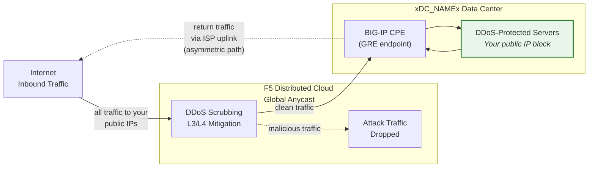
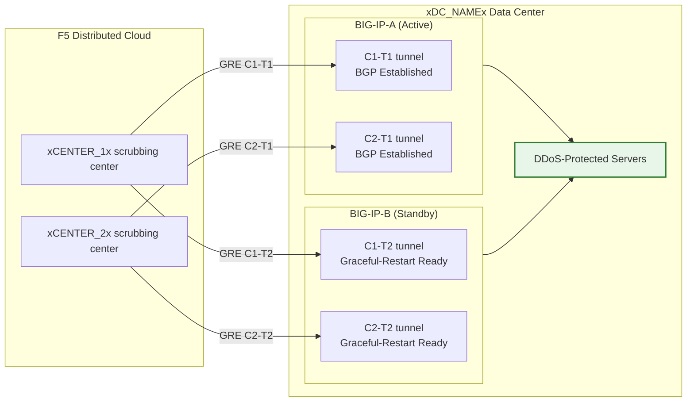

import PlaceholderForm from '../../components/PlaceholderFormWrapper.astro';

<PlaceholderForm />

## Cloud GRE/BGP BIG-IP

- Configure **GRE tunnels** and **BGP peering** from a BIG-IP HA pair
  (acting as customer premises equipment, CPE), with independent
  tunnels per unit.
- Connect to the **Cloud DDoS Mitigation** scrubbing
  centers in **routed mode** (L3/L4).

## Requirements

- Cloud **L3/L4 Routed DDoS Mitigation** service
  (Always On or Always Available) enabled for your tenant.
- BIG-IP with:
    - LTM (or equivalent networking modules).
    - **Dynamic routing (BGP)** licensed and enabled.
- Routed mode: at least one **publicly advertised /24 (or shorter)**
  prefix for protection (IPv6 minimum is **/48**).
    - Protected prefixes **must be publicly routable** (non-RFC 1918).
     GRE outer endpoints must also be publicly routable when tunnels
     traverse the public Internet; deployments using private
     connectivity (L2, private peering) may use RFC 1918 endpoint
     addresses.
- Connectivity between your data center/router and the
  Cloud scrubbing center(s).

## HA Architecture

The BIG-IP is deployed as an **active/standby HA pair**, each unit
gets its own independent GRE tunnels and BGP sessions to every
scrubbing center:

- **Independent tunnel endpoints**: Each BIG-IP unit has its own
  non-floating outer self IP (`traffic-group-local-only`) and its
  own set of GRE tunnels. BIG-IP-A uses `xBIGIP_A_OUTER_V4x` and
  BIG-IP-B uses `xBIGIP_B_OUTER_V4x` as tunnel endpoints. This avoids
  dependence on a floating IP for tunnel sourcing.
- **Independent BGP sessions**: Each unit runs its own BGP sessions
  over its own tunnels. BIG-IP-A peers with C1-T1 and C2-T1;
  BIG-IP-B peers with C1-T2 and C2-T2. On failover the standby
  unit's BGP sessions are already established, so the
  Cloud can shift traffic immediately.
- **Config sync**: Tunnel, self IP, and routing configurations are
  synced between units via **config-sync**. Because the `imish`
  BGP configuration is per-unit, each unit maintains its own
  neighbor statements. Verify sync includes all tmsh objects.
- **Active/standby BGP behavior**: The active unit advertises
  protected prefixes with normal BGP attributes. The standby unit
  can either advertise the same prefixes with a longer AS-path
  prepend (making it less preferred) or suppress advertisements
  until failover. Coordinate the approach with the SOC.
- **Failover convergence**: With `graceful-restart` enabled and
  independent tunnels, the new active unit already has established
  BGP sessions. Convergence depends on BGP best-path selection
  shifting to the newly active unit's advertisements. Test with
  `run sys failover standby`.

:::note
The independent-tunnel HA model above is the recommended approach
for customer-side device redundancy. Validate your specific
failover design with your account team before going to
production, particularly around AS-path prepend strategy and BGP
reconvergence timing.
:::
