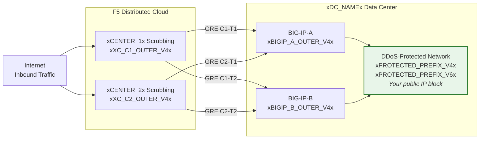
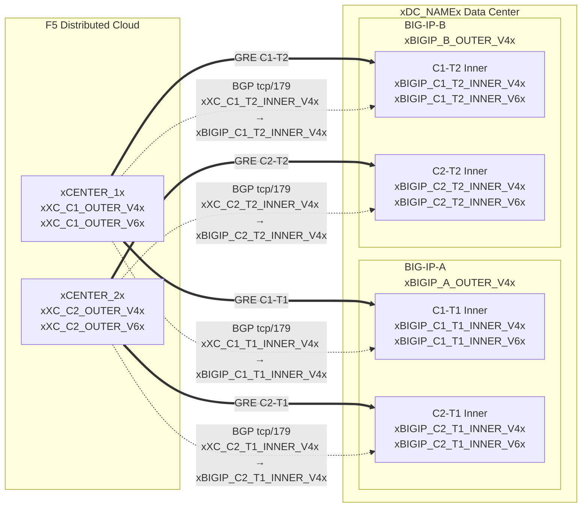

import PlaceholderForm from '../../components/PlaceholderFormWrapper.astro';

<PlaceholderForm />

## Topology and addresses

Configuration for the **xDC_NAMEx** data center
connecting to Cloud scrubbing centers.

:::note
**These are example values.** Replace with customer-specific and
SOC provided values using the tables above.

Protected prefixes **must be publicly routable** (non-RFC 1918).
GRE outer endpoint IPs must also be publicly routable when tunnels
traverse the public Internet; private connectivity (L2, private
peering) may allow RFC 1918 endpoints. See
[K000147949](https://my.f5.com/manage/s/article/K000147949) for examples using proper documentation
addresses.

For redundancy, create **2 tunnels per BIG-IP unit** to different
geo-located scrubbing centers (4 tunnels total for an HA pair).
:::

## Worksheets

Use the following XC and BIG-IP worksheets as reference when building the tunnel configuration.

### XC

**Tunnel C1-T1 — Center 1 to BIG-IP-A:**

- GRE outer IPs (for tunnel endpoints):
    - IPv4 SRC: `xXC_C1_OUTER_V4x/24`
    - IPv4 DST: `xBIGIP_A_OUTER_V4x/24`
    - IPv6 SRC: `xXC_C1_OUTER_V6x/64`
    - IPv6 DST: `xBIGIP_A_OUTER_V6x/64`

- GRE inner IPs (for BGP session):
    - IPv4: `xXC_C1_T1_INNER_V4x/30`
    - IPv6: `xXC_C1_T1_INNER_V6x/64`

**Tunnel C1-T2 — Center 1 to BIG-IP-B:**

- GRE outer IPs (for tunnel endpoints):
    - IPv4 SRC: `xXC_C1_OUTER_V4x/24`
    - IPv4 DST: `xBIGIP_B_OUTER_V4x/24`
    - IPv6 SRC: `xXC_C1_OUTER_V6x/64`
    - IPv6 DST: `xBIGIP_B_OUTER_V6x/64`

- GRE inner IPs (for BGP session):
    - IPv4: `xXC_C1_T2_INNER_V4x/30`
    - IPv6: `xXC_C1_T2_INNER_V6x/64`

**Tunnel C2-T1 — Center 2 to BIG-IP-A:**

- GRE outer IPs (for tunnel endpoints):
    - IPv4 SRC: `xXC_C2_OUTER_V4x/24`
    - IPv4 DST: `xBIGIP_A_OUTER_V4x/24`
    - IPv6 SRC: `xXC_C2_OUTER_V6x/64`
    - IPv6 DST: `xBIGIP_A_OUTER_V6x/64`

- GRE inner IPs (for BGP session):
    - IPv4: `xXC_C2_T1_INNER_V4x/30`
    - IPv6: `xXC_C2_T1_INNER_V6x/64`

**Tunnel C2-T2 — Center 2 to BIG-IP-B:**

- GRE outer IPs (for tunnel endpoints):
    - IPv4 SRC: `xXC_C2_OUTER_V4x/24`
    - IPv4 DST: `xBIGIP_B_OUTER_V4x/24`
    - IPv6 SRC: `xXC_C2_OUTER_V6x/64`
    - IPv6 DST: `xBIGIP_B_OUTER_V6x/64`

- GRE inner IPs (for BGP session):
    - IPv4: `xXC_C2_T2_INNER_V4x/30`
    - IPv6: `xXC_C2_T2_INNER_V6x/64`

:::note[Inner (transit) IPs]
Inner IPs such as `10.10.10.0/30` use RFC 1918 addresses. This is
correct because they are encapsulated inside the GRE tunnel and never
appear on the public Internet. Protected prefixes must always be
publicly routable; outer endpoint IPs must be publicly routable when
tunnels traverse the public Internet.
:::

:::note[IPv6 inner links]
IPv6 inner links use /64 prefixes here to match common
Cloud defaults. For point-to-point links, /127 is preferred per
[RFC 6164](https://datatracker.ietf.org/doc/html/rfc6164) to avoid neighbor-discovery exhaustion. Use /127
if the SOC tunnel assignment supports it.
:::

### BIG-IP

**BIG-IP-A** (outer IP `xBIGIP_A_OUTER_V4x` / `xBIGIP_A_OUTER_V6x`):

- GRE outer IPs:
    - IPv4 SRC: `xBIGIP_A_OUTER_V4x/24`
    - IPv4 DST (Center 1): `xXC_C1_OUTER_V4x/24`
    - IPv4 DST (Center 2): `xXC_C2_OUTER_V4x/24`
    - IPv6 SRC: `xBIGIP_A_OUTER_V6x/64`
    - IPv6 DST (Center 1): `xXC_C1_OUTER_V6x/64`
    - IPv6 DST (Center 2): `xXC_C2_OUTER_V6x/64`

- GRE inner IPs — Tunnel C1-T1:
    - IPv4: `xBIGIP_C1_T1_INNER_V4x/30`
    - IPv6: `xBIGIP_C1_T1_INNER_V6x/64`

- GRE inner IPs — Tunnel C2-T1:
    - IPv4: `xBIGIP_C2_T1_INNER_V4x/30`
    - IPv6: `xBIGIP_C2_T1_INNER_V6x/64`

**BIG-IP-B** (outer IP `xBIGIP_B_OUTER_V4x` / `xBIGIP_B_OUTER_V6x`):

- GRE outer IPs:
    - IPv4 SRC: `xBIGIP_B_OUTER_V4x/24`
    - IPv4 DST (Center 1): `xXC_C1_OUTER_V4x/24`
    - IPv4 DST (Center 2): `xXC_C2_OUTER_V4x/24`
    - IPv6 SRC: `xBIGIP_B_OUTER_V6x/64`
    - IPv6 DST (Center 1): `xXC_C1_OUTER_V6x/64`
    - IPv6 DST (Center 2): `xXC_C2_OUTER_V6x/64`

- GRE inner IPs — Tunnel C1-T2:
    - IPv4: `xBIGIP_C1_T2_INNER_V4x/30`
    - IPv6: `xBIGIP_C1_T2_INNER_V6x/64`

- GRE inner IPs — Tunnel C2-T2:
    - IPv4: `xBIGIP_C2_T2_INNER_V4x/30`
    - IPv6: `xBIGIP_C2_T2_INNER_V6x/64`

- Protected prefixes (advertised to Cloud):
    - IPv4: `xPROTECTED_NET_V4xxPROTECTED_CIDR_V4x`
    - IPv6: `xPROTECTED_PREFIX_V6x`

### Detailed topology diagram

